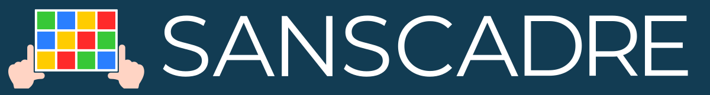
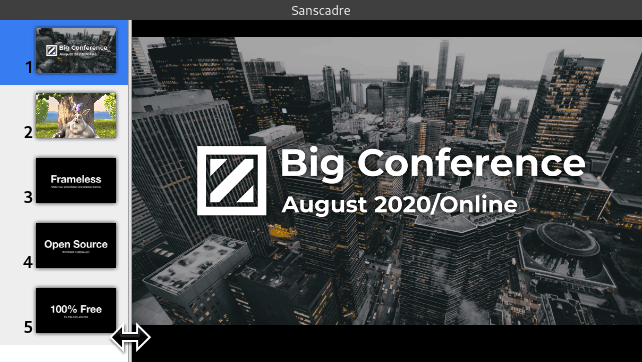

# Sanscadre

Sanscadre is a simple media player with a frameless window.
This is a standalone application built on Electron, so you don't need to set-up your environment to run it.

## Motivation

When you hold a conference or workshop online, it is difficult to show your media by screen sharing.
For example, Zoom support screen sharing to share your desktop or certain window to your participants in the meeting, or to live streaming.
Zoom shares not only content in the window but also contains the window's menu and title bar.
Besides, switching the desktop window has a high risk due to an incident to share a window you don't want to show.

Sanscadre is a frameless and simple media player to help your presentation.
The window of Sanscadre doesn't have a menu bar, title bar, and other toolboxes in the window.
Sanscadre supports many types of media, such as an image, video, and PDF document.
You can play and switch their medias quickly by your keyboard.
It makes your presentation safer and easier.

## Features

- [X] Play images (any images types supported by Chrome such as JPEG, PNG and so on)
- [X] Play videos (any video types supported by Chrome such as mp4, WebM, and so on)
- [X] PDF support
- [X] Multi-platform; supported on Windows, macOS, and Linux.

## Install

Sanscadre works on Windows (64-bit), macOS(64-bit), and Linux(64-bit).
Download the latest version from [Sanscadre release](https://github.com/ueokande/sanscadre/releases).

## License

[MIT](./LICENSE.md)
